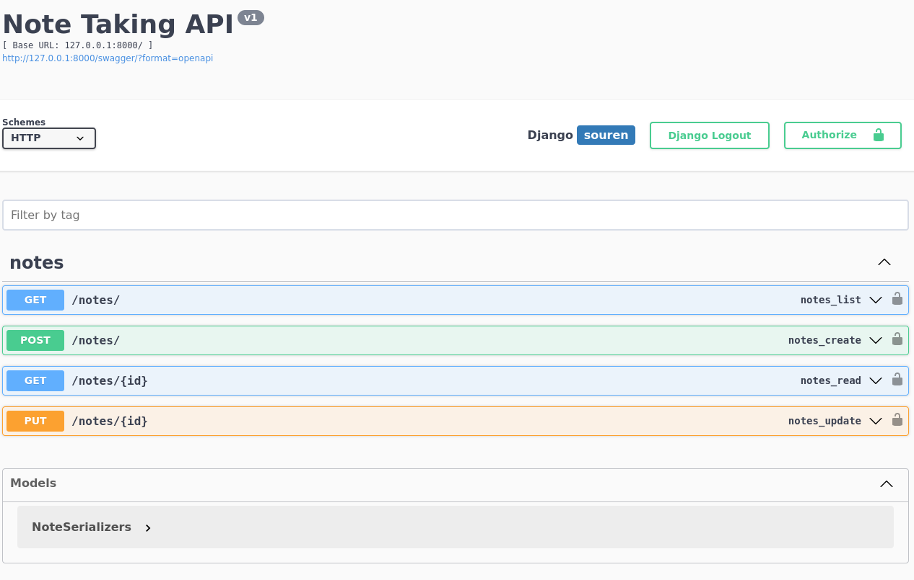

# Note Taker

Note taker is built on django with drf for rest apis and swagger for documentation

## Installation


```bash
pip install -r requirements.txt
python manage.py makemigrations
python mange.py migrate
```

## Usage
run development server by
```
python manage.py runserver
```
swagger page is available at

```
http://127.0.0.1/swagger
```
all api endpoints can be tested from swagger page easily.

## TestCase
only two test case create notes and list notes is covered 
```
python manage.py test
```